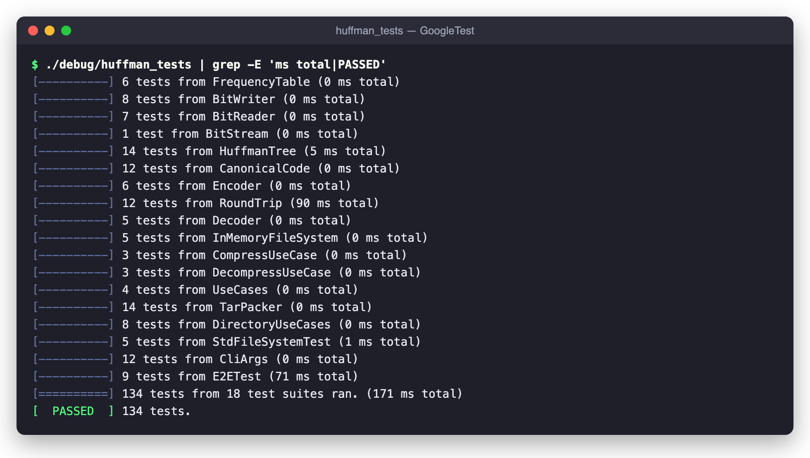
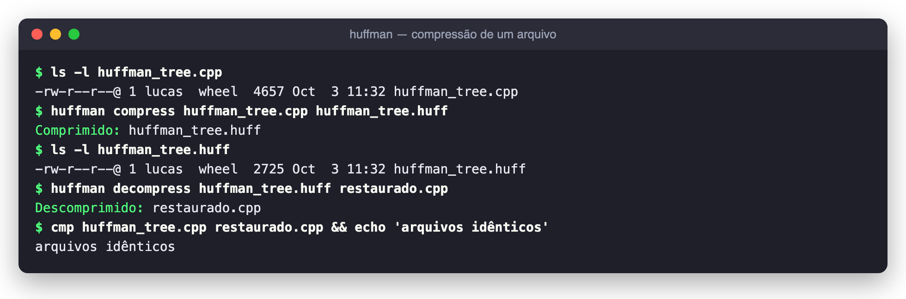
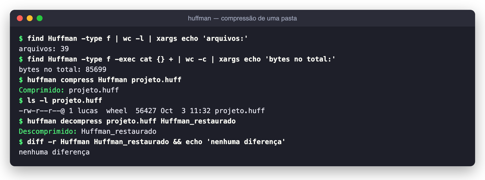
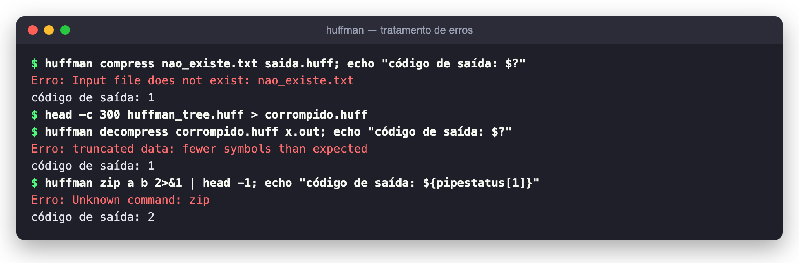

# Huffman — Codificador e Compressor de Arquivos

**Número da Lista**: 3<br>
**Conteúdo da Disciplina**: Algoritmos Ambiciosos (Greedy) — Código de Huffman e códigos de prefixo ótimos<br>
**Link de Apresentação**: https://youtu.be/tSINmvo6Bb0

## Alunos

| Matrícula | Aluno                   |
| --------- | ----------------------- |
| 231027159 | Lucas Alves             |
| 231027186 | Samuel Nogueira Caetano |

## Sobre

O **Huffman** é um compressor de dados sem perdas, de linha de comando, construído sobre o
**Código de Huffman**. Ele comprime **qualquer tipo de arquivo** (texto, binário, imagem, ...) e
também **pastas inteiras com subpastas**, gerando um único arquivo `.huff` que pode ser
descomprimido de volta, byte a byte, no conteúdo original.

### Modelagem

- **Alfabeto**: os 256 valores possíveis de um byte (`kAlphabetSize = 256`). Por trabalhar
  com bytes, e não com caracteres, o compressor funciona com qualquer arquivo.
- **Peso de cada símbolo**: a quantidade de vezes que o byte aparece na entrada, contada pela
  `FrequencyTable` em uma única passada.
- **Árvore de Huffman**: árvore binária em que cada folha é um byte e o caminho da raiz até
  ela (esquerda = `0`, direita = `1`) é o código daquele byte. Bytes mais frequentes ficam mais
  rasos e, portanto, recebem códigos mais curtos.

Os principais tipos do núcleo (`Huffman/include/huffman/core/`):

| Estrutura        | Tipo                               | Papel                                                      |
| ---------------- | ---------------------------------- | ---------------------------------------------------------- |
| `FrequencyTable` | `array<uint64_t, 256>`             | Frequência de cada byte na entrada                         |
| `HuffmanTree`    | `vector<Node>` + `priority_queue`  | Constrói a árvore e devolve o comprimento do código de cada byte |
| `CodeLengths`    | `array<uint8_t, 256>`              | Profundidade de cada folha (0 = byte não aparece)          |
| `CanonicalCode`  | tabelas por comprimento            | Gera os códigos canônicos e decodifica símbolo a símbolo   |
| `BitWriter` / `BitReader` | buffer de bytes           | Escrevem e leem a sequência de bits, do bit mais significativo para o menos |

### Algoritmo

A construção dos códigos é o **algoritmo guloso de Huffman**, implementado em
`HuffmanTree::buildHuffmanCodeLengths`:

1. Cada byte com frequência > 0 vira uma folha e entra em uma **fila de prioridade mínima**
   (`std::priority_queue`) ordenada pelo peso.
2. **Escolha gulosa**: enquanto houver mais de um nó na fila, retiram-se os **dois de menor
   peso** e eles são unidos em um novo nó interno, cujo peso é a soma dos dois. O novo nó volta
   para a fila.
3. O nó que sobra é a raiz. Uma DFS (`assignDepths`) percorre a árvore e registra a
   profundidade de cada folha, que é o comprimento do código daquele byte.
4. Os comprimentos são limitados a 32 bits (`limitCodeLengths`), ajustando-os até que a
   **desigualdade de Kraft** volte a ser satisfeita. Na prática isso só acontece com
   distribuições extremamente desbalanceadas.

Em empates de peso, o nó de menor índice sai primeiro, então a árvore gerada é sempre a
mesma para a mesma entrada. Casos de borda: entrada vazia não gera códigos, e uma entrada com
um único byte distinto recebe um código de 1 bit.

**Por que o guloso funciona**: os dois símbolos menos frequentes podem sempre ser colocados
como irmãos no nível mais profundo de alguma árvore ótima (propriedade da escolha gulosa), e
fundi-los reduz o problema a um alfabeto com um símbolo a menos que ainda tem solução ótima
(subestrutura ótima). Por isso o código de Huffman é um **código de prefixo ótimo**: nenhum
outro código de prefixo produz uma saída menor para aquelas frequências.

#### Códigos canônicos

A árvore em si não é gravada no arquivo. A partir dos comprimentos, a `CanonicalCode` atribui
os códigos de forma **canônica**: os símbolos são ordenados por (comprimento, valor do byte) e
recebem códigos consecutivos. Assim, basta gravar **256 bytes** com o comprimento de cada
símbolo no cabeçalho para que o decodificador reconstrua exatamente os mesmos códigos. A
decodificação lê um bit por vez e, para cada comprimento, testa se o código acumulado cai no
intervalo de códigos daquele comprimento, sem precisar montar a árvore.

#### Complexidade

Seja `N` o tamanho da entrada em bytes e `σ ≤ 256` o número de bytes distintos:

| Etapa                         | Tempo            |
| ----------------------------- | ---------------- |
| Contagem de frequências       | O(N)             |
| Construção da árvore (heap)   | O(σ log σ)       |
| Códigos canônicos             | O(σ)             |
| Codificação / decodificação   | O(N · L), com `L ≤ 32` o maior código |

Como `σ` é limitado por 256, o custo total é **O(N)** em tempo e espaço.

### Por que isso importa

O código de Huffman é peça central de formatos usados todos os dias: o **DEFLATE** (ZIP, gzip,
PNG), o **JPEG** e o **MP3** usam códigos de Huffman, inclusive na forma canônica, como etapa
final de compressão.

## Screenshots

### 1. Suíte de testes — 134 testes, 18 suítes

Todos os módulos são cobertos por testes com GoogleTest, escritos antes da implementação (TDD),
do contador de frequências até testes ponta a ponta que executam o binário de verdade.



### 2. Comprimindo e descomprimindo um arquivo

O próprio código-fonte da árvore de Huffman (`huffman_tree.cpp`, 4.657 bytes) cai para
2.725 bytes, cerca de 58% do original, e volta idêntico depois da descompressão.



### 3. Comprimindo uma pasta inteira

A pasta `Huffman/` do projeto (39 arquivos em várias subpastas, 85.699 bytes) vira um único
`projeto.huff` de 56.427 bytes. Depois de descomprimida, `diff -r` não aponta nenhuma
diferença em relação à original.



### 4. Tratamento de erros

Arquivo inexistente e `.huff` truncado terminam com código `1` e uma mensagem clara, sem
gerar saída parcial silenciosa. Um comando desconhecido termina com código `2`.



## Instalação

**Linguagem**: C++20<br>
**Framework**: GoogleTest (testes) + CMake ≥ 3.20 (build)<br>

### Pré-requisitos

- Compilador com suporte a C++20 (`g++` ≥ 10 ou `clang++` ≥ 12)
- CMake 3.20 ou superior
- Git e acesso à internet na primeira configuração: o GoogleTest (v1.15.2) é **baixado
  automaticamente** pelo CMake via `FetchContent`, não é preciso instalá-lo

Instalação das dependências:

```bash
# Ubuntu / Debian
sudo apt update
sudo apt install build-essential cmake git

# macOS (Homebrew)
xcode-select --install
brew install cmake
```

### Clonando

```bash
git clone https://github.com/projeto-de-algoritmos-2026/Greed_Codificador-Huffman.git
cd Greed_Codificador-Huffman
```

### Compilando

```bash
cmake -S . -B debug
cmake --build debug --parallel
```

São gerados dois executáveis em `debug/`: `huffman` (a CLI) e `huffman_tests` (a suíte de testes).

Sem CMake, só a CLI pode ser compilada direto com o compilador:

```bash
g++ -std=c++20 -O2 -IHuffman/include Huffman/src/*/*.cpp apps/cli/main.cpp -o huffman
```

## Uso

A sintaxe é:

```bash
./huffman compress   <entrada>       <saída.huff>
./huffman decompress <entrada.huff>  <saída>
```

- `compress`: `<entrada>` pode ser um **arquivo** ou uma **pasta** (com subpastas).
- `decompress`: o tipo é lido do próprio `.huff`. Se o original era um arquivo, `<saída>` é o
  arquivo restaurado; se era uma pasta, `<saída>` é a pasta onde a árvore será recriada.
- `./huffman`, `./huffman -h` ou `./huffman --help` mostram a ajuda.

Exemplos:

```bash
# Um arquivo qualquer
./huffman compress   relatorio.pdf relatorio.huff
./huffman decompress relatorio.huff relatorio-restaurado.pdf

# Uma pasta inteira
./huffman compress   meu_projeto/ meu_projeto.huff
./huffman decompress meu_projeto.huff meu_projeto_restaurado/
```

Códigos de saída: `0` em caso de sucesso, `1` em erro de execução (arquivo inexistente,
`.huff` corrompido ou truncado, ...) e `2` para argumentos inválidos.

### Formato do arquivo `.huff`

Todos os inteiros são gravados em _little-endian_.

```
┌──────────┬──────────────────┬───────────────────────────┬──────────────────────┐
│ tipo     │ nº de símbolos   │ comprimentos dos códigos  │ dados codificados    │
│ 1 byte   │ uint64 (8 bytes) │ 256 bytes (1 por byte)    │ bits, com padding    │
└──────────┴──────────────────┴───────────────────────────┴──────────────────────┘
  0 = arquivo
  1 = pasta
```

O número de símbolos diz ao decodificador quando parar, o que torna irrelevantes os bits de
_padding_ do último byte. Quando a entrada é uma pasta, o que é codificado não é um arquivo, e
sim um **contêiner HTAR** gerado pelo `TarPacker`:

```
"HTAR" │ nº de entradas (uint32) │ entrada 1 │ entrada 2 │ ...

entrada: é_pasta (1 byte) │ tamanho do caminho (uint16) │ caminho │ tamanho do conteúdo (uint64) │ conteúdo
```

Os caminhos são relativos à pasta comprimida, então pastas vazias também são preservadas.

## Como ele funciona

O projeto segue uma **arquitetura em camadas** (_ports and adapters_), em que o núcleo do
algoritmo não sabe nada sobre disco ou linha de comando:

1. **CLI** (`cli/args`, `apps/cli/main.cpp`): `parseArgs` valida os argumentos e decide o
   comando. O `main` instancia o sistema de arquivos real e chama o caso de uso.
2. **Casos de uso** (`app/`): `CompressUseCase` verifica se a entrada é arquivo ou pasta. Se
   for pasta, lista o conteúdo recursivamente e empacota tudo com o `TarPacker`. Em seguida
   codifica o resultado e grava o byte de tipo seguido do bloco codificado.
   `DecompressUseCase` faz o caminho inverso: lê o tipo, decodifica e, se for pasta,
   desempacota e recria arquivos e diretórios.
3. **Núcleo** (`core/`): `HuffmanEncoder` conta as frequências, monta a árvore, gera os códigos
   canônicos e escreve os bits. `HuffmanDecoder` lê o cabeçalho, reconstrói os códigos canônicos
   e decodifica símbolo a símbolo, lançando `CorruptDataError` se os dados acabarem antes do
   esperado.
4. **Sistema de arquivos** (`ports/` e `infra/`): os casos de uso dependem só da interface
   `IFileSystem`. Em produção ela é implementada por `StdFileSystem` (`std::filesystem`); nos
   testes, por um `InMemoryFileSystem` falso, o que permite testar compressão de pastas sem
   tocar no disco.

## Testes

São **134 testes** em 18 suítes, organizados em um arquivo por módulo:

| Arquivo                                | Testes | O que cobre                                                                 |
| -------------------------------------- | ------ | --------------------------------------------------------------------------- |
| `core/test_frequency_table.cpp`        | 6      | Contagem, total e número de símbolos distintos                              |
| `core/test_bit_stream.cpp`             | 16     | Escrita e leitura bit a bit, _padding_ e fim de dados                       |
| `core/test_huffman_tree.cpp`           | 14     | Comprimentos ótimos, exemplo clássico do CLRS, Kraft, limite de 32 bits e **otimalidade em 50 tabelas aleatórias** |
| `core/test_canonical_code.cpp`         | 12     | Atribuição canônica, códigos livres de prefixo e decodificação              |
| `core/test_encoder_decoder.cpp`        | 23     | Cabeçalho, tamanho exato do _payload_, ida e volta (UTF-8, binário, aleatório) e dados corrompidos |
| `archive/test_tar_packer.cpp`          | 14     | Empacotamento HTAR e rejeição de contêineres inválidos                      |
| `ports/test_in_memory_file_system.cpp` | 5      | O sistema de arquivos falso usado nos testes                                |
| `infra/test_std_file_system.cpp`       | 5      | Leitura, escrita e listagem recursiva no disco real                         |
| `app/test_use_cases.cpp`               | 10     | Compressão e descompressão de arquivos, arquivo vazio, `.huff` vazio ou truncado |
| `app/test_directory_use_cases.cpp`     | 8      | Pastas aninhadas, pastas e arquivos vazios, binários e listagem restaurada  |
| `cli/test_cli_args.cpp`                | 12     | Interpretação dos argumentos da linha de comando                            |
| `cli/test_e2e.cpp`                     | 9      | Ponta a ponta: executa o binário `huffman` e confere saídas e códigos de saída |

O teste `CostIsOptimalOnRandomTables` merece destaque: ele calcula o custo ótimo
(`Σ frequência × comprimento`) de forma independente, somando os pesos de cada fusão, e
confere que a árvore gerada atinge exatamente esse custo. É a verificação direta de que a
escolha gulosa produz um código ótimo.

### Executando os testes

```bash
cmake -S . -B debug
cmake --build debug --parallel
./debug/huffman_tests
```

Ou pelo CTest, que roda cada teste individualmente:

```bash
ctest --test-dir debug --output-on-failure
```

Os testes ponta a ponta executam o binário `huffman` de verdade, por isso o CMake sempre o
compila antes de `huffman_tests`.

### Pelo VS Code

O repositório já traz as tasks em `.vscode/tasks.json`. Pressione `Ctrl+Shift+B`
(`Cmd+Shift+B` no macOS) para rodar a task padrão **"CMake: compilar debug"**, que configura
e compila o projeto na pasta `debug/`. Depois, basta executar `./debug/huffman_tests`.

## Estrutura do Repositório

```
.
├── CMakeLists.txt              # Build da biblioteca, da CLI e dos testes
├── apps/
│   └── cli/main.cpp            # Ponto de entrada do executável huffman
├── Huffman/
│   ├── include/huffman/        # Cabeçalhos públicos
│   │   ├── core/               # Frequências, árvore, código canônico, bits, encoder/decoder
│   │   ├── archive/            # TarPacker (contêiner HTAR para pastas)
│   │   ├── app/                # Casos de uso e formato do contêiner .huff
│   │   ├── ports/              # Interface IFileSystem
│   │   ├── infra/              # StdFileSystem (std::filesystem)
│   │   └── cli/                # Parser de argumentos
│   ├── src/                    # Implementações, mesma divisão de include/
│   └── tests/                  # Testes com GoogleTest, mesma divisão + fakes/
├── assets/                     # Imagens usadas neste README
└── .vscode/                    # Tasks e configuração de debug
```

## Outros

### Metodologia

O projeto foi desenvolvido com **TDD (Test Driven Development)**: o histórico do Git mostra,
módulo a módulo, o teste sendo adicionado antes da implementação. A ordem seguiu as camadas,
de dentro para fora: núcleo do algoritmo → sistema de arquivos → casos de uso → empacotamento
de pastas → CLI.

### Decisões de projeto

- **Código canônico em vez de serializar a árvore**: o cabeçalho tem tamanho fixo (256 bytes
  de comprimentos), é simples de validar e não exige recursão para ler.
- **Injeção do sistema de arquivos**: como os casos de uso recebem um `IFileSystem`, toda a
  lógica de compressão de pastas é testada em memória, rápida e sem efeitos colaterais.
- **Compilação estrita**: a biblioteca e a CLI são compiladas com
  `-Wall -Wextra -Wpedantic -Werror`, então qualquer aviso quebra o build.

### Limitações conhecidas

- **Cabeçalho fixo de 265 bytes**: arquivos muito pequenos (algumas centenas de bytes) podem
  ficar **maiores** depois de comprimidos. O mesmo vale para dados que já são comprimidos ou
  aleatórios (`.zip`, `.jpg`, `.mp4`), em que as frequências dos bytes são quase uniformes.
- **Tudo é carregado em memória**: a entrada inteira (ou todos os arquivos da pasta) é lida
  para a RAM antes de ser codificada, então o tamanho máximo depende da memória disponível.
- **Huffman estático de ordem zero**: cada byte é codificado de forma independente, sem
  explorar repetições de sequências como fazem LZ77/DEFLATE. Por isso a taxa de compressão
  fica abaixo de ferramentas como `gzip`.
- **Sem metadados**: permissões, datas de modificação e links simbólicos não são preservados
  ao comprimir pastas.
- A descompressão sobrescreve o destino sem pedir confirmação.
